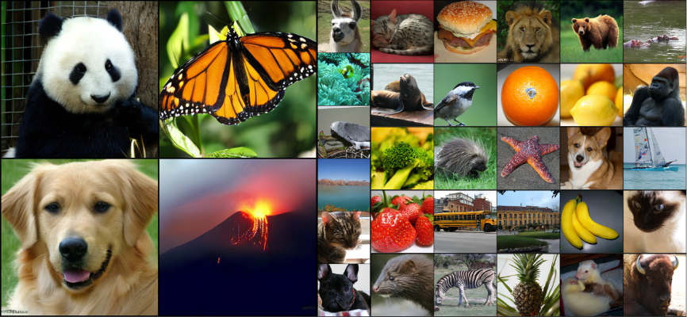

# Continuous Speculative Decoding for Autoregressive Image Generation <br><sub>Official PyTorch Implementation</sub>

[](https://arxiv.org/abs/2411.11925)&nbsp;

<p align="center">
  
</p>

This is a PyTorch/GPU implementation of the paper [Continuous Speculative Decoding for Autoregressive Image Generation](https://arxiv.org/abs/2411.11925):

```
@article{wang2024continuous,
  title={Continuous Speculative Decoding for Autoregressive Image Generation},
  author={Wang, Zili and Zhang, Robert and Ding, Kun and Yang, Qi and Li, Fei and Xiang, Shiming},
  journal={arXiv preprint arXiv:2411.11925},
  year={2024}
}
```

## Preparation

Please refer to the [MAR](https://github.com/LTH14/mar.git) repo for basic installation of dependencies and pretrained checkpoints.


## Usage

### Demo
Run our interactive visualization [demo](https://colab.research.google.com/github/MarkXCloud/CSpD/blob/main/demo/run_mar.ipynb) using Colab notebook!

## Acknowledgements
Codes in this repo is largely based on [MAR](https://github.com/LTH14/mar.git). We thank the authors of MAR for the contributions to the community.

## Contact

If you have any questions, feel free to contact me through email (wangzili2022@ia.ac.cn). Enjoy!